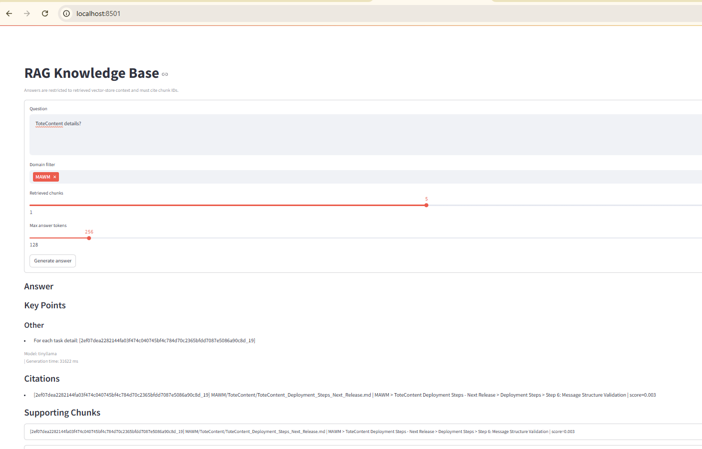
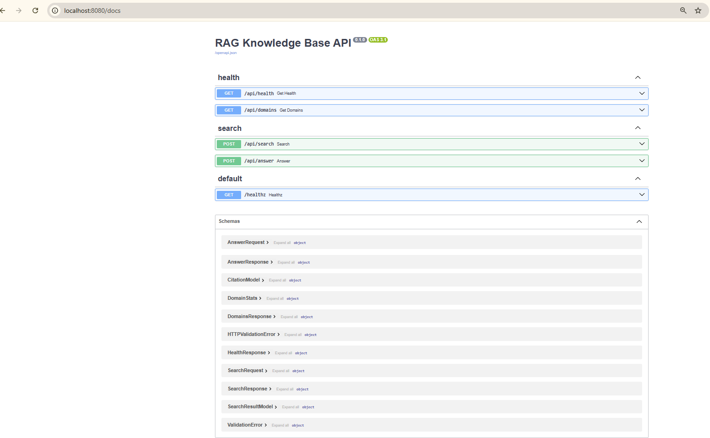

# RAG Knowledge Base (Local)

This is a local Docker-based RAG stack for indexing markdown notes and searching them semantically. It uses Ollama, ChromaDB, FastAPI, and Streamlit to show the full flow end-to-end: ingestion, embeddings, vector search, retrieval, grounded answer generation, and citations.

This project is useful for:

This project is for engineers who want to understand a local RAG stack end-to-end using Docker, Ollama, ChromaDB, FastAPI, and Streamlit.
It is not intended as a production-ready enterprise RAG platform.

- Developers learning local RAG architecture
- Engineers who want a Docker + Ollama + ChromaDB reference implementation
- People who want to understand the full flow instead of using a black-box tool
- Anyone building a private knowledge base for markdown notes
- Engineers preparing for AI, agent, or RAG architecture interviews
- Teams evaluating local RAG before moving to Bedrock, Azure AI Search, Vertex AI, or similar platforms

## Demo


RAG UI with citation results:



## Quick Start

```bash
bash scripts/start-local.sh
bash scripts/run-ingestion.sh
```

- Run ingestion at least once before expecting results in search/answer/UI.
- First run can take longer because Docker images and Ollama models are downloaded.

## Access URLs

- RAG UI (Streamlit): `http://localhost:8501/`
- ChromaDB heartbeat: `http://localhost:8000/api/v1/heartbeat`
- Ollama endpoint: `http://localhost:11434/`

## Startup Command

Use a single command to start the stack:

```bash
bash scripts/start-local.sh
```

On Windows, you can start the same flow with built-in PowerShell:

```powershell
.\scripts\start-stack.ps1
```

What the script does:

- Starts `ollama` and `chromadb`
- Waits for Ollama to become ready
- Creates `.env` from `.env.example` if it does not exist
- Pulls the configured Ollama models if they are missing
- Starts `api` and `ui`

Default models:

- `LLM_MODEL=tinyllama:latest`
- `EMBEDDING_MODEL=nomic-embed-text`

If `./scripts/start-stack.sh` is not executable in your shell, run:

```bash
bash ./scripts/start-stack.sh
```

## What Runs

- `ollama` on port `11434`
- `chromadb` on port `8000` (pinned Docker image tag)
- `api` on port `8080`
- `ui` on port `8501`
- `ingestion` (one-shot pipeline container)

## Prerequisites

- Docker Desktop (Compose V2)
- Bash on macOS or Linux, or PowerShell on Windows

## 1. Open Project

```bash
cd /c/Repo/sdontireddy/Projects/rag-knowledge-base
```

## 2. Optional: Customize Environment Settings

The startup script auto-creates `.env` from `.env.example` on first run. If you want to customize settings before startup, create `.env` manually and edit it.

```bash
cp .env.example .env
```

Example override in `.env`:

```bash
CHROMADB_IMAGE_TAG=0.5.5
```

## 3. Add Documents for Ingestion

Put markdown files under:

- `knowledge_base/AWS`
- `knowledge_base/AI`

You can change domain folders with `SOURCE_DIRS` in `.env`.

## 4. Start the Stack

```bash
./scripts/start-stack.sh
```

The startup script handles `.env` bootstrap, base services, readiness checks, model pull, and app startup. On Windows, use PowerShell:

```powershell
.\scripts\start-stack.ps1
```

If you are on macOS or Linux and your shell does not execute `./scripts/start-stack.sh` directly, use:

```bash
bash ./scripts/start-stack.sh
```

First-run timing note:

- The first startup can take significantly longer because Docker may need to pull base images and Ollama may need to download models.
- Later startups are much faster because images and models are cached locally.

Optional: view logs

```bash
docker compose logs -f api
```

## 5. Run Ingestion

This is the first task you must run to get search or answer results.

- Until ingestion completes at least once, `/api/search`, `/api/answer`, and the UI will not have indexed knowledge to return meaningful results.

Run the ingestion pipeline as a one-shot container:

```bash
bash scripts/run-ingestion.sh
```

Expected output includes report file write to:

- `reports/ingestion_report.json` on the host (configurable via `HOST_INGESTION_REPORT_PATH`)

Incremental behavior:

- The first run ingests all discovered markdown files.
- Later runs read the previous ingestion report timestamp and skip files whose modified time is not newer than that baseline.
- Set `INGESTION_MIN_FILE_DELTA_SECONDS` in `.env` if you want a buffer before a recently modified file is considered eligible for re-ingestion.
- When a file is re-ingested, existing vectors for that source file are removed first so stale chunks do not accumulate.

## 6. Verify Services

API Reference:

- Swagger-style document: `docs/api-swagger-style.md`
- Live OpenAPI docs: `http://localhost:8080/docs`

Swagger UI:



Health:

```bash
curl http://localhost:8080/api/health
```

Domains:

```bash
curl http://localhost:8080/api/domains
```

Search:

```bash
curl -X POST http://localhost:8080/api/search \
  -H "Content-Type: application/json" \
  -d '{"query":"bedrock","k":5,"domain_filter":["AWS"],"min_score":0.0}'
```

Answer generation:

```bash
curl -X POST http://localhost:8080/api/answer \
  -H "Content-Type: application/json" \
  -d '{"query":"How do I enable Bedrock?","k":5,"domain_filter":["AWS"],"max_tokens":512}'
```

Grounding rules for `/api/answer`:

- Answers are built from retrieved vector-store chunks only.
- If the model returns uncited or invalid content, the API downgrades the response to `INSUFFICIENT_CONTEXT`.
- Citations are restricted to chunk IDs that were actually retrieved for that request.

UI:

- Open `http://localhost:8501` to ask grounded questions and inspect citations.

## 7. Run Tests

```bash
/c/Repo/sdontireddy/MyNotes/.venv/Scripts/python -m pytest tests/unit tests/integration/test_ingestion_pipeline.py -q
```

## 8. Stop Stack

```bash
docker compose down
```

Remove volumes too:

```bash
docker compose down -v
```

## Notes

- ChromaDB runs as a Docker service (`chromadb`), not as a local host process.
- API ingest endpoints are not exposed yet; ingestion is currently executed via `docker compose run --rm ingestion`.
- Memory constraints forced us to use tinyllama:latest
- Increased timeout, with proper error messaging

## TODO

### Infra Improvements

1.  Create Startup Script - DONE
2.  Update Docker Compose - DONE
    - Check the Ollama volume if exists or not
3.  Prerequisite tests to make sure all the required models are available and heartbeats are accessible - DONE

#### Embeddings

- Currently only markdown file support
- Future
  - Image
  - PDF
  - Q: To keep apps modular, can we have separate PDF-RAG-KNOWLEDGE-BASE and IMAGE-RAG-KNOWLEDGE-BASE tools?

##### Optimizations

- How to improve the ranking for relvant information
- How to improve the ranking for relevant information
  - Currently search results are OK , we need to make them better
  - Structure the knowledge base
    - Markdown explore a better template / tagging/ metadata
- Currently on local setup , so latencies very high
  - Deploy this in a PROD like machine and benchmark
- No specific Guardrails yet
- Check if we need to tweak the config for Ollama - DONE
  - **RCA** : generation failed with larger models because available Docker memory was low, so switched to tinyllama:latest
- Play with token size, retrieved chunks
- Code Review and Statistical analysis

#### Documentations

- Swagger for API - DONE
- Update Tradeoffs and create a brain map

### Current state:

Recommend to engineers / learners: Yes
Recommend to non-technical users: Not yet
Recommend as production-ready: No
Recommend as portfolio project: Absolutely yes
